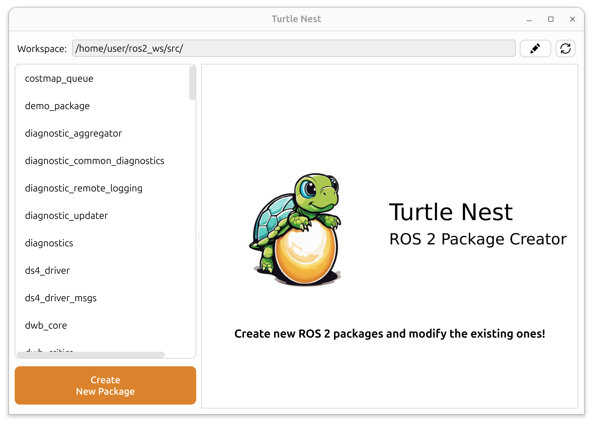
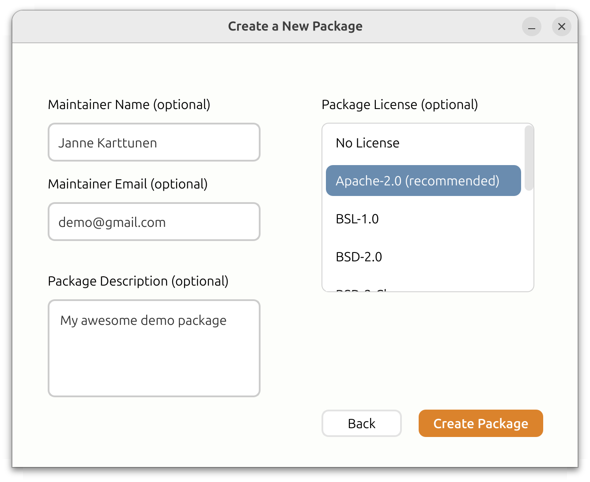
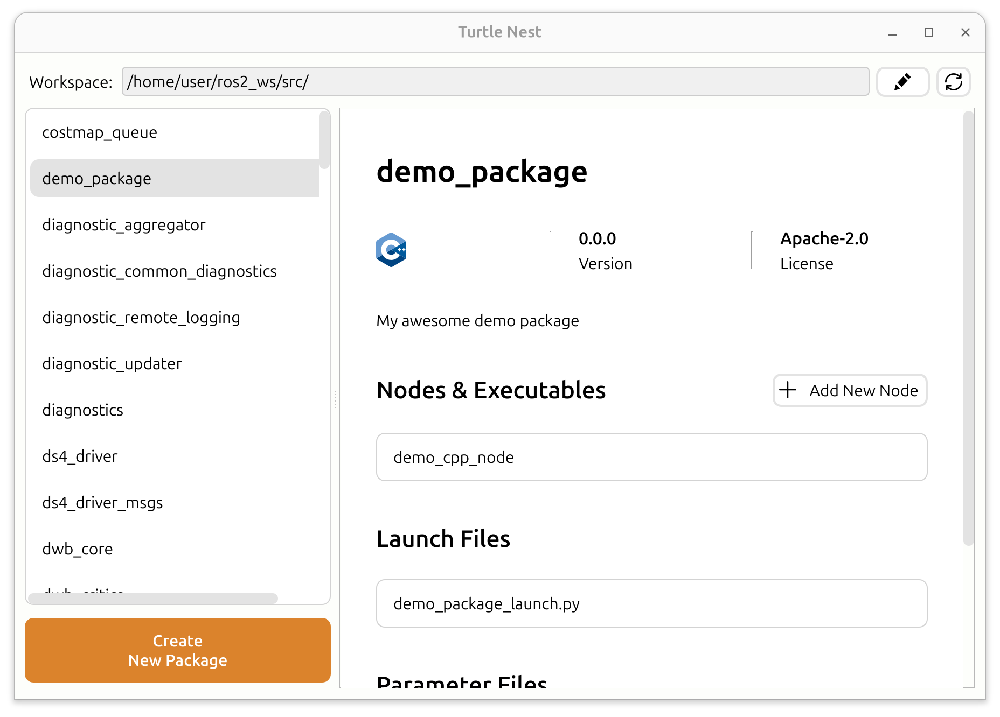

# Turtle Nest

Just as the natural turtle nests are the birthplace for young turtles, ROS 2 Turtle Nest is where new ROS packages are born and brought to life.

Turtle Nest provides an easy graphical user interface for creating new ROS packages, and for modifying existing ones, simplifying the package creation process.

Turtle Nest offers the following key features:
- [**Create new ROS 2 packages**](#create-new-ros-2-packages-easily) quickly with a guided interface
- [**Explore existing packages**](#explore-existing-packages) in your workspace
- [**Add new nodes to existing packages**](#add-new-nodes-to-existing-packages) with support for both Python and C++



### Create new ROS 2 packages easily

Creating new ROS 2 packages with Turtle Nest is fast, intuitive, and eliminates the usual setup hassles.
It offers the following benefits:

- **Supports multiple package types**: C++, Python, Mixed (C++ & Python), and Custom Msg Interfaces
- **Creates Nodes** - C++, Python, Lifecycle. Fully executable out of the box and ready for further development.
- **Easy to use** - no need to dig through the ROS 2 documentation for the right commands or manually add things to CMakeLists.txt or setup.py.
- **Automatically adds necessary dependencies** - rclpy, rclcpp, rosidl_default_generators, ...
- **Option to create launch and parameter files** - to run your nodes with a single command, with parameter examples.
- **Naming conventions enforced** - no more failing builds due to incorrect package or node names.
- **Remembers the important details** - workspace path, maintainer name, and maintainer email for your future packages.

### Explore existing packages

Get a clear overview of the ROS 2 packages in your workspace, without digging through folders or files.
Turtle Nest makes it easy to explore package contents and structure, offering the following benefits:

- **See key package information** - such as package type (Python, C++, or message-only), description, license, and more.
- **List all executables** - identify the nodes provided by the package.
- **List launch files and parameter files**

### Add new nodes to existing packages

Quickly expand your existing packages without worrying about boilerplate or setup details.
Turtle Nest can add new nodes to your packages with just a press of a button!

Just click the "**Add New Node**" button for your existing package and enter a name for the node.
The new node is automatically created with the correct file structure, includes example content to get you started, and updates all necessary configuration files like CMakeLists.txt or setup.py, so you can jump straight into development.

This works for any standard ROS 2 package that follows typical conventions (i.e., no heavily customized or non-standard CMakeLists.txt or setup.py files).

## Prerequisites

- Ubuntu 22 or 24
- Python 3.9+
- ROS 2 (any one of the following versions)
  - Humble
  - Iron
  - Jazzy
  - Rolling

## Installation

Install the package by running:
```
sudo apt update
sudo apt install ros-${ROS_DISTRO}-turtle-nest
```

* If your `${ROS_DISTRO}` env variable is not set, replace it with your ROS 2 distribution, such as `humble` or `jazzy`.

### Alternative Installation - Build from Source

The previous installation method is usually sufficient for most users. 
However, if you want the latest features or want to customize the Turtle Nest, you can build it from source:

<details>
  <summary>Click to open instructions for building from source</summary>

  ```
  mkdir -p $HOME/ros2_ws/src/
  cd $HOME/ros2_ws/src/
  git clone https://github.com/Jannkar/turtle_nest.git
  cd ..
  sudo apt-get update
  rosdep install --from-paths src --ignore-src -r -y --rosdistro ${ROS_DISTRO}
  colcon build
  source install/setup.bash
  ```

</details>

## Usage
To run the application, simply execute:

```
turtle-nest
```

### New package creation
Set a new or existing workspace for your ROS 2 packages in the UI. 
Select "Create New Package" and fill in the necessary information to create a new ROS 2 package. 

After the package has been created, build and source the new package as normal:

```
cd <ros2_ws_location>
colcon build --symlink-install
source install/setup.bash
```
<br>
<details>
  <summary><i>Optional step:</i> Add your workspace to bashrc for automatic sourcing in new terminals (only once per workspace)</summary>

    echo "source <ros2_ws_location>/install/setup.bash" >> ~/.bashrc
</details>
<br>

If you created a Node or a launch file, you can run them with one the following commands:

* Run your Nodes using the launch file:
    ```
    ros2 launch <package_name> <launch_file_name>
    ```
* Run a single Node (without parameters):
    ```
    ros2 run <package_name> <node_name>
    ```
* Run a single Node with a parameter file:
  ```
  ros2 run <package_name> <node_name> --ros-args --params-file <params_file_path>
  ```
    

## Build Status

| Distro | Status | 
| :---:  | :---:  |
| Humble | [](https://build.ros2.org/job/Hbin_uJ64__turtle_nest__ubuntu_jammy_amd64__binary/)|
| Iron | [](https://build.ros2.org/job/Ibin_uJ64__turtle_nest__ubuntu_jammy_amd64__binary/)  |
| Jazzy | [](https://build.ros2.org/job/Jbin_uN64__turtle_nest__ubuntu_noble_amd64__binary/)  |
| Rolling | [](https://build.ros2.org/job/Rbin_uN64__turtle_nest__ubuntu_noble_amd64__binary/)  |

## Screenshots





## Star History

[](https://star-history.com/#Jannkar/turtle_nest&Date)

## Maintainers

- [Janne Karttunen](https://www.linkedin.com/in/janne-karttunen-a22375209/) (Henki Robotics)

<br>

**Looking for professional ROS 2 development services?** Check us out at [Henki Robotics](https://henkirobotics.com)

[](https://henkirobotics.com)
