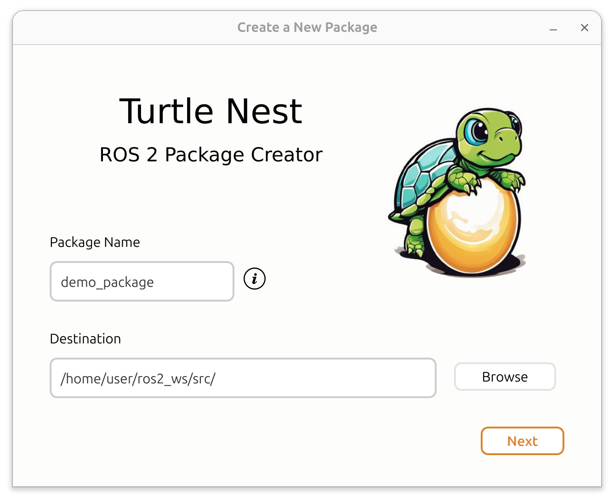
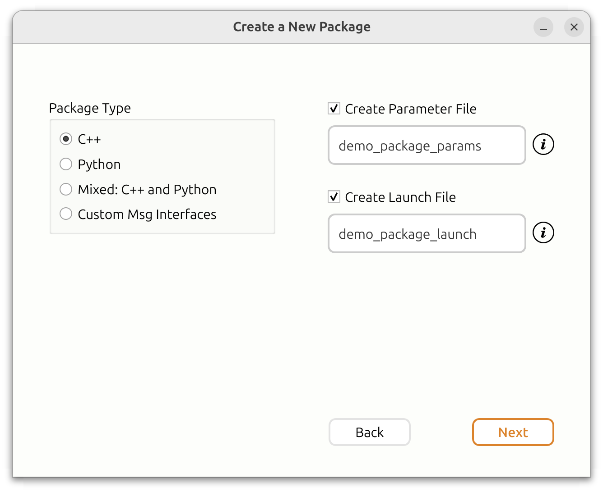
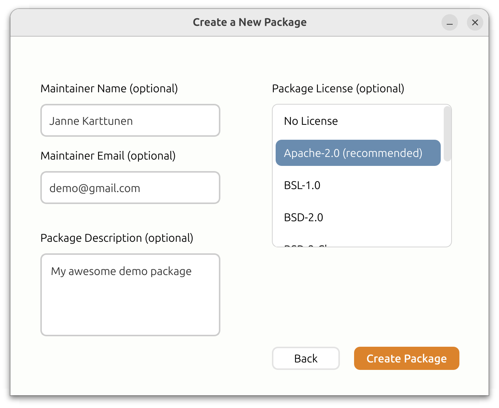

Just as a turtle nest is the birthplace for young turtles, ROS 2 Turtle Nest is where new ROS packages are born and brought to life.

Turtle Nest provides an easy graphical user interface for creating new ROS packages, simplifying the package creation process.

<h2>Why to use Turtle Nest over 'ros2 pkg create' command?</h2>

- **Easy to use** - no need to dig through the ROS 2 documentation for the right commands or manually add things to CMakeLists.txt or setup.py.
- **Create C++ and/or Python nodes** - which are ready for further development.
- **Automatically adds necessary dependencies** - rclpy, rclcpp, and std_msgs.
- **Option to create a launch file** - that launches the created node.
- **Create C++ and Python nodes within the same package** - combine languages that typically require separate packages.
- **Naming conventions enforced** - no more failing builds due to incorrect package or node names.
- **Remembers the important details** - workspace path, maintainer name, and maintainer email for the future packages.
- **And more!**

<h2>Prerequisites</h2>

- Ubuntu 22 or 24
- ROS 2 (any one of the following versions)
  - Humble
  - Iron
  - Jazzy
  - Rolling

<h2>Installation</h2>

Create a new ROS 2 workspace if you don't yet have one. Then clone the repository, install dependencies and build the application.
```
mkdir -p $HOME/ros2_ws/src/
cd $HOME/ros2_ws/src/
git clone https://github.com/Jannkar/turtle_nest.git
cd ..
sudo apt-get update
rosdep install --from-paths src --ignore-src -r -y --rosdistro ${ROS_DISTRO}
colcon build
source install/setup.bash
```

<h2>Usage</h2>
To run the application, simply execute:

```
turtle-nest
```

Fill in the necessary information in the GUI to create a new ROS 2 package. After the package has been created, build and source the new package:

```
cd $HOME/ros2_ws/
colcon build
source install/setup.bash
```

If you created a node or a launch file, you can run them with the following commands:
* To run a node:
    ```
    ros2 run <package_name> <node_name>
    ```
* To launch the launch file
    ```
    ros2 launch <package_name> <launch_file_name>
    ```

<h2>Screenshots</h2>





## Maintainers

- [Janne Karttunen](https://www.linkedin.com/in/janne-karttunen-a22375209/)
