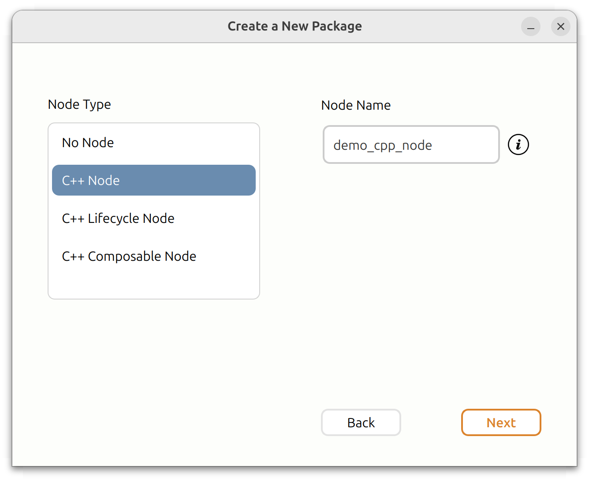

# Turtle Nest

Just as the natural turtle nests are the birthplace for young turtles, ROS 2 Turtle Nest is where new ROS packages are born and brought to life.

Turtle Nest provides an easy graphical user interface for creating new ROS packages, simplifying the package creation process.

## Why to use Turtle Nest?

- **Easy to use** - no need to dig through the ROS 2 documentation for the right commands or manually add things to CMakeLists.txt or setup.py.
- **Creates C++ and/or Python nodes** - which are ready for immediate development.
- **Automatically adds necessary dependencies** - rclpy, rclcpp, and std_msgs.
- **Option to create a launch file** - to run your nodes with a single command.
- **Option to create a parameter file** - with parameter examples for the created nodes.
- **Create C++ and Python nodes within the same package** - combine languages that typically require separate packages.
- **Naming conventions enforced** - no more failing builds due to incorrect package or node names.
- **Remembers the important details** - workspace path, maintainer name, and maintainer email for your future packages.
- **And more!**

## Prerequisites

- Ubuntu 22 or 24
- ROS 2 (any one of the following versions)
  - Humble
  - Iron
  - Jazzy
  - Rolling

## Installation

Install the package by running:
```
sudo apt update
sudo apt install ros-${ROS_DISTRO}-turtle-nest
```

* If your `${ROS_DISTRO}` env variable is not set, replace it with your ROS 2 distribution, such as `humble` or `jazzy`.
* If you are using `rolling` distribution, you still need to build the package from the source.


## Usage
To run the application, simply execute:

```
turtle-nest
```

Fill in the necessary information in the GUI to create a new ROS 2 package. 

After the package has been created, build and source the new package as normal:

```
cd <ros2_ws_location>
colcon build --symlink-install
source install/setup.bash
```
<br>
<details>
  <summary><i>Optional step:</i> Add your workspace to bashrc for automatic sourcing in new terminals (only once per workspace)</summary>

    echo "source <ros2_ws_location>/install/setup.bash" >> ~/.bashrc
</details>
<br>

If you created a Node or a launch file, you can run them with one the following commands:

* Run your Nodes using the launch file:
    ```
    ros2 launch <package_name> <launch_file_name>
    ```
* Run a single Node (without parameters):
    ```
    ros2 run <package_name> <node_name>
    ```
* Run a single Node with a parameter file:
  ```
  ros2 run <package_name> <node_name> --ros-args --params-file <params_file_path>
  ```
    

## Build Status

| Distro | Status | 
| :---:  | :---:  |
| Humble | [](https://build.ros2.org/job/Hbin_uJ64__turtle_nest__ubuntu_jammy_amd64__binary/)|
| Iron | [](https://build.ros2.org/job/Ibin_uJ64__turtle_nest__ubuntu_jammy_amd64__binary/)  |
| Jazzy | [](https://build.ros2.org/job/Jbin_uN64__turtle_nest__ubuntu_noble_amd64__binary/)  |
| Rolling | [](https://build.ros2.org/job/Rbin_uN64__turtle_nest__ubuntu_noble_amd64__binary/)  |

## Screenshots




## Star History

[](https://star-history.com/#Jannkar/turtle_nest&Date)

## Maintainers

- [Janne Karttunen](https://www.linkedin.com/in/janne-karttunen-a22375209/) (Henki Robotics)

<br>

**Looking for professional ROS 2 development services?** Check us out at [Henki Robotics](https://henkirobotics.com)

[](https://henkirobotics.com)
