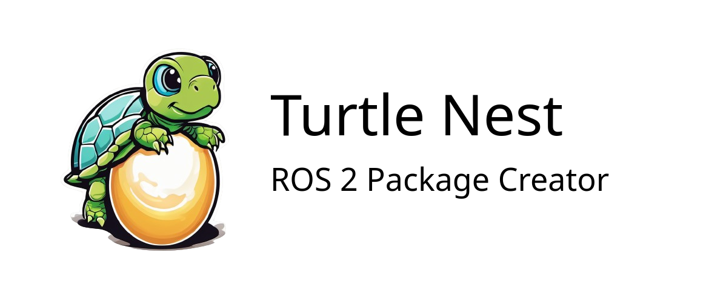

# Turtle Nest

Just as the natural turtle nests are the birthplace for young turtles, ROS 2 Turtle Nest is where new ROS packages are born and brought to life.

Turtle Nest offers a user-friendly graphical interface for creating new ROS 2 packages and adding nodes to existing ones.
Forget digging through the documentation and the countless build errors, and create your packages and nodes easily with Turtle Nest!


## Features

- 📦 **Create new ROS 2 packages** - with nodes, launch files and parameter files. Supported package types:
  - C++
  - Python
  - Mixed (C++ & Python)
  - Custom Message Interfaces
- ✨ **Create ROS 2 Nodes** - add nodes to new **and even existing packages** - with a single click! Supported node types:
  - Regular Nodes
  - Lifecycle Nodes
  - Composable Nodes
- 🔍 **List the existing packages in the workspace** - See the package information such as package type, executables, 
launch & parameter files, package description, and so on.

The created packages and nodes are ready to build and run right away, so you can jump straight into development.
Turtle Nest takes care of updating the `CMakeLists.txt`, `setup.py` and `package.xml` files with all the needed configuration and dependencies.

Turtle Nest enforces the naming conventions and best practices, so you don’t have to worry about the details.

## Prerequisites

- Ubuntu 22 or 24
- Python 3.9+
- ROS 2 (any one of the following versions)
  - Humble
  - Jazzy
  - Kilted
  - Rolling

## Installation

Install the package by running:
```
sudo apt update
sudo apt install ros-${ROS_DISTRO}-turtle-nest
```

* If your `${ROS_DISTRO}` env variable is not set, replace it with your ROS 2 distribution, such as `humble` or `jazzy`.

### Alternative Installation - Build from Source

The previous installation method is usually sufficient for most users. 
However, if you want the latest features or want to customize the Turtle Nest, you can build it from source:

<details>
  <summary>Click to open instructions for building from source</summary>

  ```
  mkdir -p $HOME/ros2_ws/src/
  cd $HOME/ros2_ws/src/
  git clone https://github.com/Jannkar/turtle_nest.git
  cd ..
  sudo apt-get update
  rosdep install --from-paths src --ignore-src -r -y --rosdistro ${ROS_DISTRO}
  colcon build
  source install/setup.bash
  ```

</details>

## Usage
To run the application, simply execute:

```
turtle-nest
```

### New package creation
Set a new or existing workspace for your ROS 2 packages in the UI. 
Select "Create New Package" and fill in the necessary information to create a new ROS 2 package. 

After the package has been created, build and source the new package as normal:

```
cd <ros2_ws_location>
colcon build --symlink-install
source install/setup.bash
```
<br>
<details>
  <summary><i>Optional step:</i> Add your workspace to bashrc for automatic sourcing in new terminals (only once per workspace)</summary>

    echo "source <ros2_ws_location>/install/setup.bash" >> ~/.bashrc
</details>
<br>

If you created a Node or a launch file, you can run them with one the following commands:

* Run your Nodes using the launch file:
    ```
    ros2 launch <package_name> <launch_file_name>
    ```
* Run a single Node (without parameters):
    ```
    ros2 run <package_name> <node_name>
    ```
* Run a single Node with a parameter file:
  ```
  ros2 run <package_name> <node_name> --ros-args --params-file <params_file_path>
  ```
    

## Build Status

| Distro  |                                                                                              Status                                                                                               | 
|:-------:|:-------------------------------------------------------------------------------------------------------------------------------------------------------------------------------------------------:|
| Humble  | [](https://build.ros2.org/job/Hbin_uJ64__turtle_nest__ubuntu_jammy_amd64__binary/) |
|  Jazzy  | [](https://build.ros2.org/job/Jbin_uN64__turtle_nest__ubuntu_noble_amd64__binary/) |
| Kilted  | [](https://build.ros2.org/job/Kbin_uN64__turtle_nest__ubuntu_noble_amd64__binary/) |
| Rolling | [](https://build.ros2.org/job/Rbin_uN64__turtle_nest__ubuntu_noble_amd64__binary/) |

## Screenshots


## Star History

[](https://star-history.com/#Jannkar/turtle_nest&Date)

## Maintainers

- [Janne Karttunen](https://www.linkedin.com/in/janne-karttunen-a22375209/) (Henki Robotics)

<br>

**Looking for professional ROS 2 development services?** Check us out at [Henki Robotics](https://henkirobotics.com)

[](https://henkirobotics.com)
